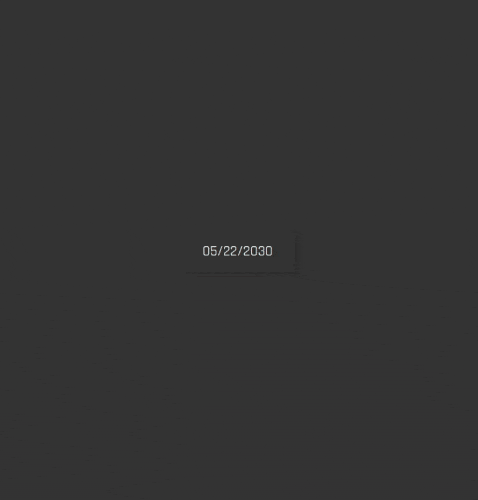

# svelte-calendar

A small date picker built with Svelte 3. Demo available here: [view docs and examples](https://6edesign.github.io/svelte-calendar).



## Installation

```sh
npm i -D svelte-calendar
```

## Features

- Day, Month & Year pickers
- Responsive
- Keyboard, touch, and scroll support
- Inline & Picker modes
- Virtual/infinite grid for animation performance
- Store-driven and extensible
- [Localization](https://6edesign.github.io/svelte-calendar) using `day.js`

## Features In Development

- time picker
- date & date-time range picker
